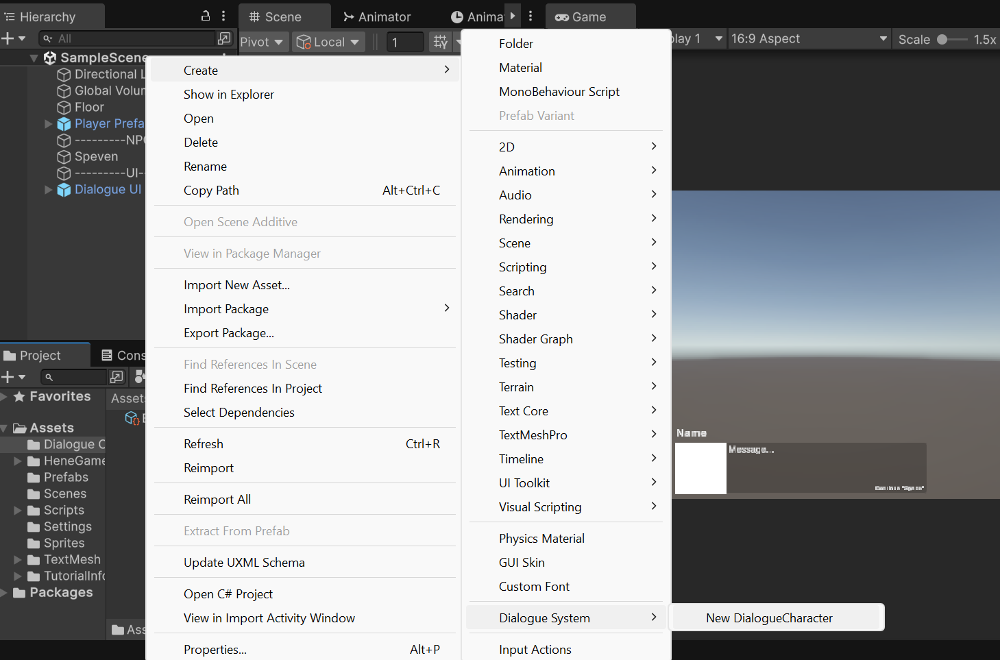
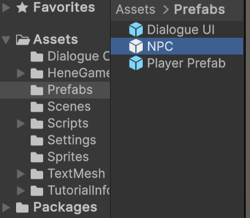
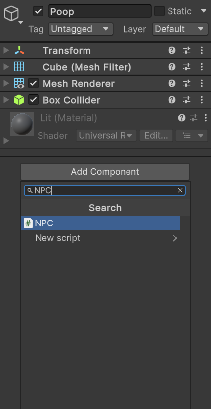
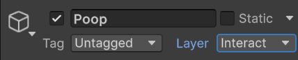
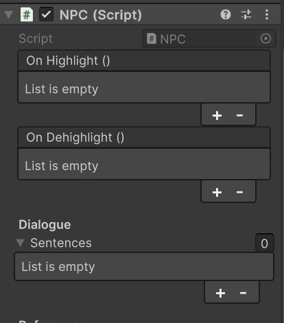

# Halloween-Murder-Party
Fall '25 SGDA Game Jam

Unity Version 6000.0.41f1 LTS

Uses [HeneGames's Dialgoue System](https://assetstore.unity.com/packages/tools/gui/dialogue-system-248969)

## How to Create a Character

1. Create a `DialogueCharacter` Scriptable Object Asset. 

2. In the inspector, give it a name: 

3. If you haven't created a Unity `Sprite` Asset, import your image, then configure it in the inspector:
   1. Set `Texture Type` to `Sprite (2D and UI)`.
   2. Set `Sprite Mode` to `Single`. If you are importing a sprite sheet, you know what you are doing and can skip this.
   3. Set `Filter Mode` to `Point (no filter)`. Prevents image blurring.
   4. Hit `Apply`.
**Note**: you may need to install Unity's 2D Sprite Editor. The inspector should prompt you if needed.

4. Go back to your `Dialogue Character` and add your `Sprite` to it.

## How to Set Up Dialogue NPC

1. You can either:
   1. Use the [`Prefabs/NPC`](Assets/Prefabs/NPC.prefab) Prefab to get a quick start. 
   
   
   2. Create the object yourself, if you need to customize the mesh, etc.
      1. Create/Import any object.
      2. Give it any 3D `Collider` component and a `NPC` script. Preferably not a mesh collider, since we want this game to run on WebGL. 
      
      
      3. Set its layer to `Interact`. 
      
      
2. Under the `NPC` script, find the `Sentences` list, under the `Dialogue` Header. 

3. Add a `Sentence`. For each one:
   1. Dialogue Character (mandatory). Switch it up for each sentence to change who is talking.
   2. Sentence Text.
   3. Skip Delay. This prevents players from spamming the text and accidentally skipping dialogue. For some reason, it defaults to 0, even though it shouldn't.
   4. You can explore the other things if you like, or wait for me to implement them.

Use [`Scenes/SampleScene`](Assets/Scenes/SampleScene.unity), which has a player pre-configured, to test out your NPC.