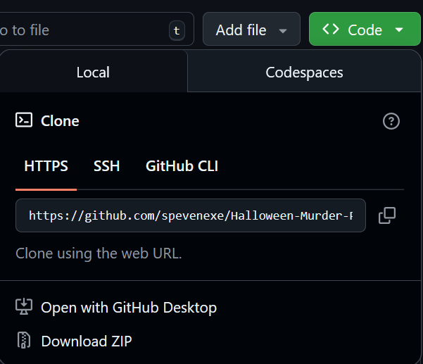
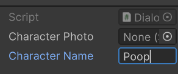
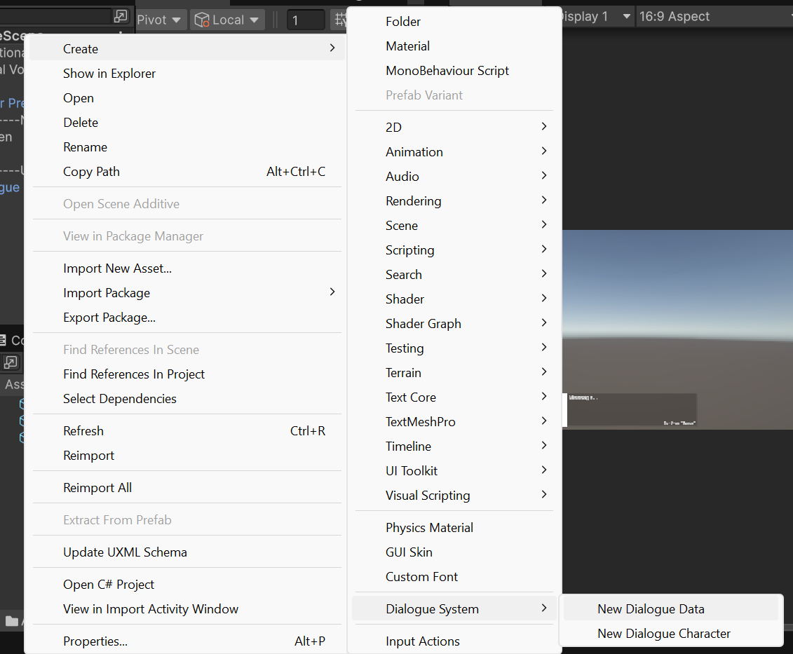
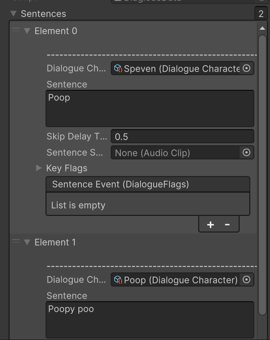
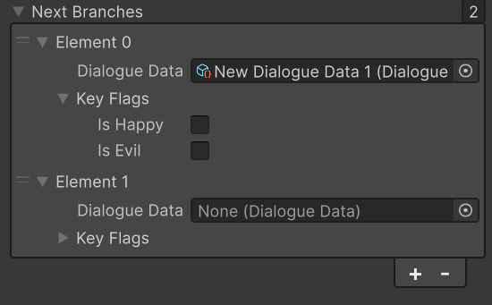

# Halloween-Murder-Party
Fall '25 SGDA Game Jam

Unity Version 6000.0.41f1 LTS

Uses [HeneGames's Dialogue System](https://assetstore.unity.com/packages/tools/gui/dialogue-system-248969)

## How to Get the Repository Installed Locally

**NOTE**: You need [Git](https://git-scm.com/)

1. Open a terminal to a folder where you keep projects.
2. **Clone** the repository: 
```bash
git clone https://github.com/spevenexe/Halloween-Murder-Party.git
```
3. This will create a folder *in* the folder you are in called `Halloween Murder Party`. You can open it in Unity and do your thing.

## How to REFLECT your changes on here (the remote repository)

Open a terminal to the folder of your project. Your path should look like:
```bash
C:\....some_stuff...\Halloween Murder Party\>
```

In that terminal execute these commands, in this order:

```bash
git add .
```
```bash
git commit -m "some informative message"
```
```bash
git push
```

## How to GET changes from here (the remote repository)

**MAKE SURE YOU DO THIS**. Otherwise, `git` will tickle your bootyhole.

1. Open a terminal to the folder of your project. Your path should look like:
```bash
C:\....some_stuff...\Halloween Murder Party\>
```
2. Execute these commands, in this order:
```bash
git fetch
```
```bash
git pull
```
3. The End.

## How to Create a Character

1. Create a `Dialogue Character` Scriptable Object Asset. 


2. In the inspector, give it a name: 



3. If you haven't created a Unity `Sprite` Asset, import your image, then configure it in the inspector:
   1. Set `Texture Type` to `Sprite (2D and UI)`.
   2. Set `Sprite Mode` to `Single`. If you are importing a sprite sheet, you know what you are doing and can skip this.
   3. Set `Filter Mode` to `Point (no filter)`. Prevents image blurring.
   4. Hit `Apply`.
**Note**: you may need to install Unity's 2D Sprite Editor. The inspector should prompt you if needed.

4. Go back to your `Dialogue Character` and add your `Sprite` to it.

## How to Create a Conversation

1. Create a `Dialogue Data` Scriptable Object Asset:



2. Under `Sentences`, add a new sentence. For each one:
   1. `Dialogue Character` object (mandatory). Switch it up for each sentence to change who is talking.
   2. Sentence Text.
   3. `Skip Delay`. This prevents players from spamming the text and accidentally skipping dialogue. For some reason, it defaults to 0, even though it shouldn't.
   4. You can explore the other things if you like, or wait for me to implement them.
3. `Interaction Cost` defines how much it costs to activate the dialogue, (regarding the mechanical approach of limiting the number of interacts)
4. `Do Loop` tells the conversation to loop. Only works if `Sentences` is empty.



3. If you want, you can add branching in the `Next Branches` list. For each branch, you'll need to make another `Dialogue Data` object and pass it to the element. The flags are scuffed and unimplemented. 
   
   Default behavior:
   1. If there are no branches, the dialogue finishes and the NPC becomes unavailable.
   2. Otherwise, proceed to the first branch in the list
   3. If `Do Loop` is `true` and `Sentences` is empty, begin looping the text 
   4. `TODO:` make it work with flags (haven't done it yet)



**TIP**: if you need the NPC to repeat what it said last time by default, then you can make the reference to the first branch the same exact `Dialogue Data` object.

## How to Set Up Dialogue NPC

1. You can either:
   1. Use the [`Prefabs/NPC`](Assets/Prefabs/NPC.prefab) Prefab to get a quick start. 
   
   

   2. Create the object yourself, if you need to customize the mesh, etc.
      1. Create/Import any object.
      2. Give it any 3D `Collider` component and a `NPC` script. Preferably not a mesh collider, since we want this game to run on WebGL. 
      
      

      3. Set its layer to `Interact`. 
      
      

2. Under the `NPC` script, find the `Dialogue Data` object, under the `Dialogue` Header. 


3. Add in the `Dialogue Data` object you created.

Use [`Scenes/SampleScene`](Assets/Scenes/SampleScene.unity), which has a player pre-configured, to test out your NPC.